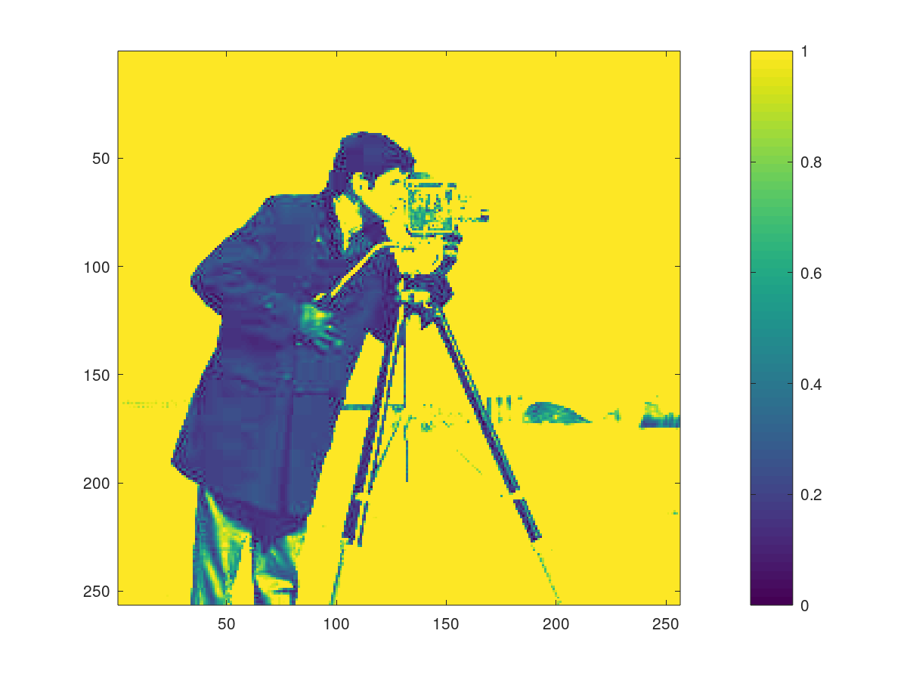
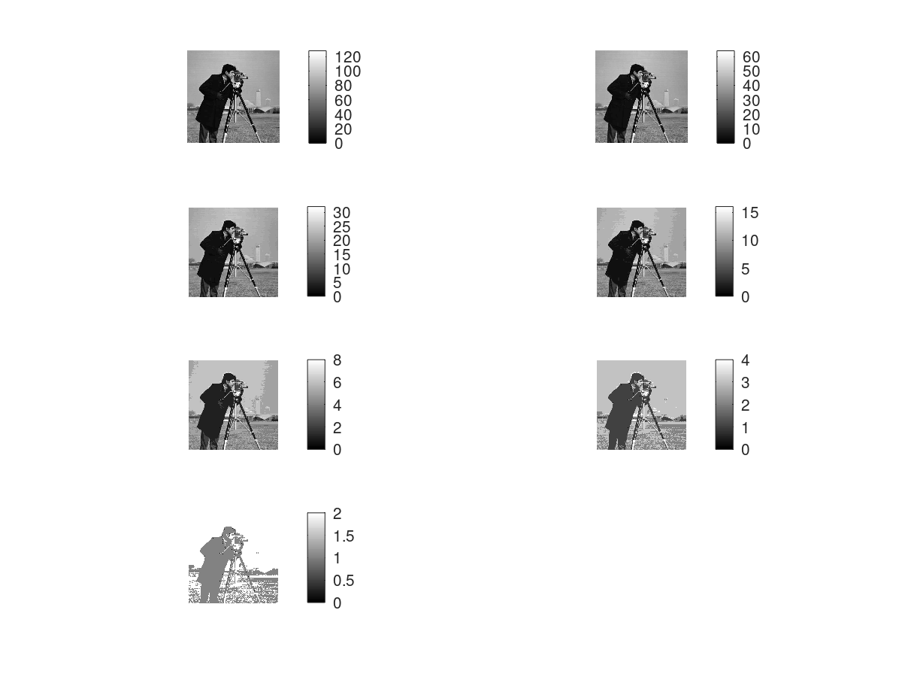
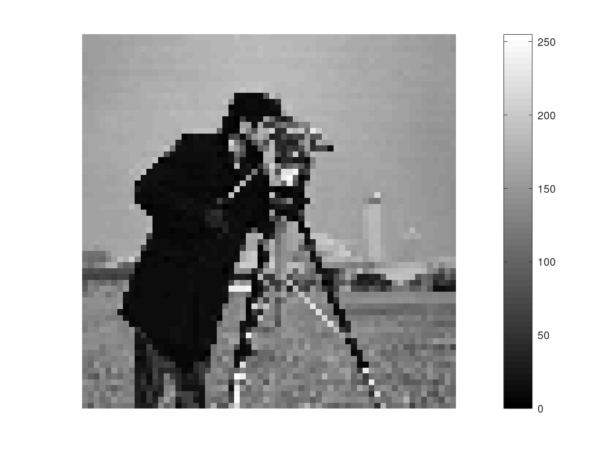
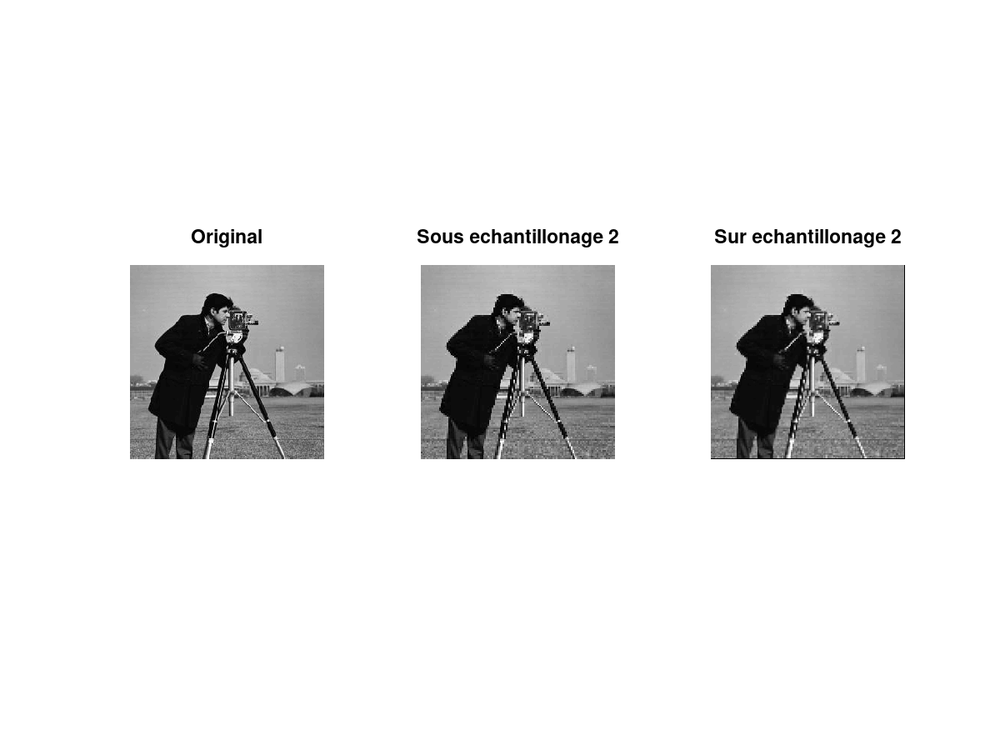
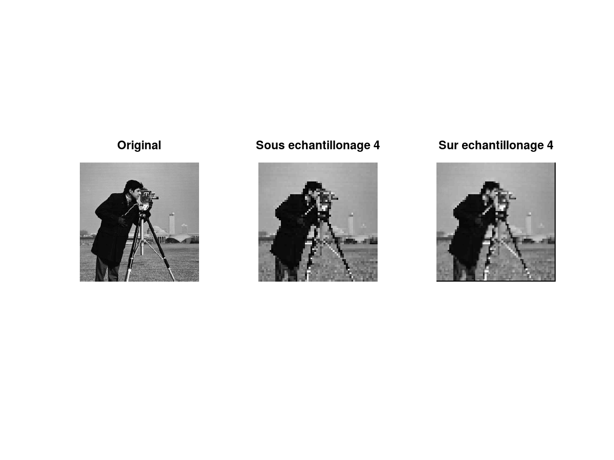
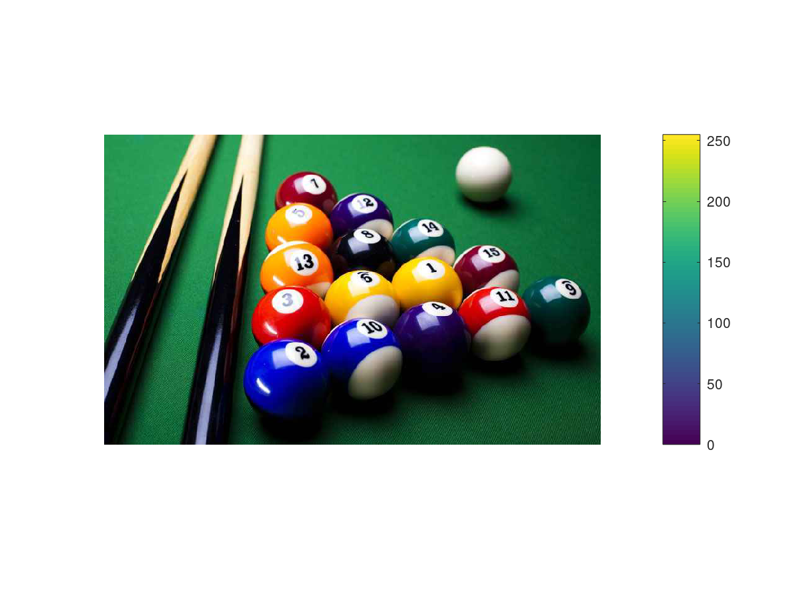
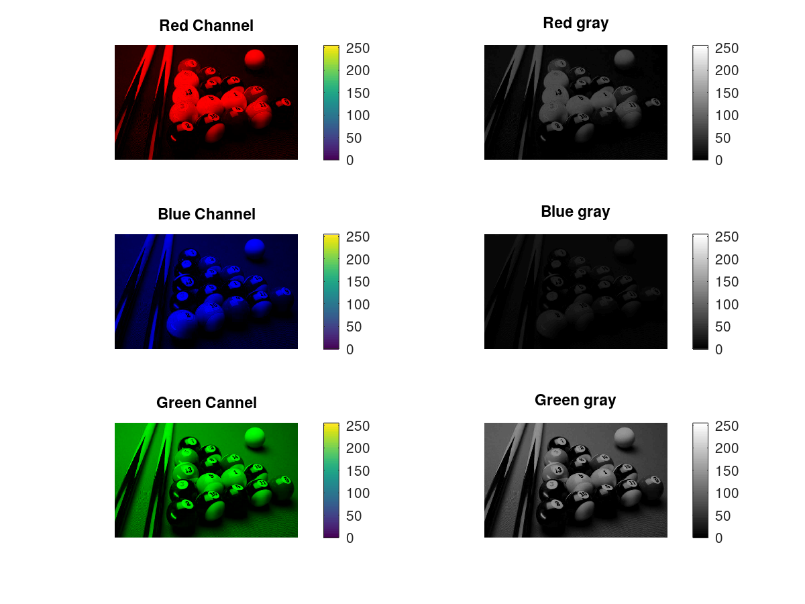
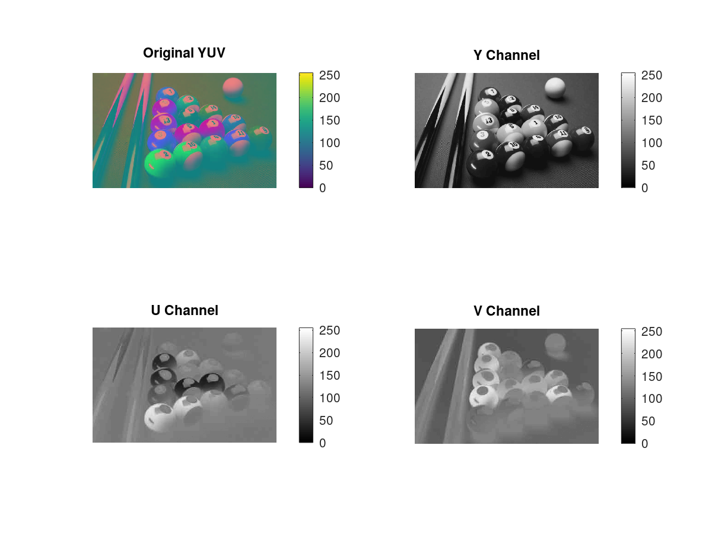
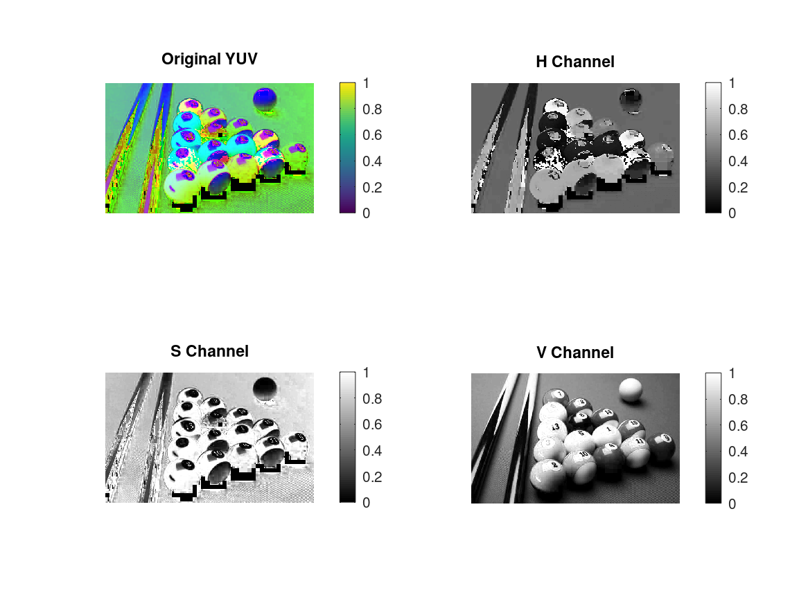

# Traitement d'Image

> Auteurs :
>
> * Léa CHEMOUL
> * Valentin Berger

## TP1 - Échantillonnage et Quantification

### 1 - Définition

> Quelle est la taille minimale entre 2 objets pour qu’ils soient distinguables à 30cm?

On utilise le théorème de Pythagore généralisé :

\\&space;=&space;30^2&space;&plus;&space;30^2&space;-&space;2&space;\cdot&space;30&space;\cdot&space;30&space;\cdot&space;cos(\frac{1}{60})\\&space;=&space;0.008727&space;\text{&space;cm})

La taille minimale entre deux objets situés à 30cm est de 0.087 millimètres.

> Quelle est la taille d’un pixel d’un smarphone de 5 pouces avec une définition HD 720

Le nombre de pixels est de 1280x720 (car HD 720), et on sait que l'écran mesure 11,1x6,2 cm.

La taille d'un pixel en millimètres est donc :


Ainsi un pixel mesure 0.087mm de large sur 0.86mm de long.

>  Si ce smarphone est tenu à 30cm de l’œil, cette définition est-elle suffisante?

Dans la première question, on a calculé que la distance minimale entre deux objets (ici des pixels) est de 0.25 cm pour qu'ils soient distinguables. Or, la largeur d'un pixel est de . Donc les pixels sont distinguables à 30 centimètres de l'utilisateur, donc la définition n'est pas suffisante.

> En dessous de quelle distance (entre la personne et l’écran) une personne peut-elle distinguer les pixels d’un écran d’ordinateur de 22 pouces avec une définition HD 1080?

Un écran 22 pouces est de dimension 48,7x27,4 cm. Un défintion HD 1080 a une résolution de 1920x1080. La taille d'un pixel est de :


Ainsi, un pixel est de 0.25x0.25mm.

On calcule maintenant la distance minimale :

&space;\quad&space;\text{&space;avec&space;}&space;d&space;\text{&space;étant&space;la&space;distance&space;}&space;(d&space;:=&space;b&space;=&space;c)\\&space;a^2&space;=&space;2&space;d^2&space;(1&space;-&space;\cos(\frac{1}{60}))\\&space;\Leftrightarrow&space;d^2&space;=&space;2&space;\frac{a^2}{1&space;-&space;\cos(\frac{1}{60})}\\&space;\Leftrightarrow&space;d&space;=&space;\sqrt{\frac{a^2}{2&space;(1&space;-&space;\cos(\frac{1}{60}))}})

> Soit une personne souhaitant acheter un écran de télévision, qui est placé à 2m de son canapé.
Cette personne tient absolument à avoir une définition Ultra HD. À partir de quelle taille
d’écran (parmi celles proposées), cette résolution devient-elle distinguable d’une définition HD
1080?

Dans un premier temps on suppose que nous avons un écran HD de 50 pouces, puis de 55 pouces.

```
Distance minimale écran 50 pouces HD : 198.207588 cm

Distance minimale écran 55 pouces HD : 218.082062 cm
```

On constate que entre 50 et 55 pouces cette définition n'est plus suffisante pour une sitance de plus de 200cm = 2m.

```
Distance minimale écran 50 pouces Ultra HD : 99.103794 cm

Distance minimale écran 55 pouces Ultra HD : 109.041031 cm
```

Cette fois-ci en passant à un écran Ultra HD la distance est correcte.
Entre 50 et 55 pouces, il donc est necessaire de passer en Ultra HD afin de bien distinguer un écran situé à 2m

> Quelle est la définition de cette image?

```matlab
[cameraman, map, alpha] = imread("data/cameraman.jpg");
imshow(cameraman, map);
dimen = size(cameraman);
printf("Dimension de l'image: %dx%d pixels\n\n", dimen(1), dimen(2));
```

La dimension de l'image est de 256x256 pixels.

> Quelle est sa taille théorique sur le disque? Comparer avec la taille réelle et commenter.

```matlab
taille_theorique = dimen(1) * dimen(2) * 3

info = imfinfo("data/cameraman.jpg");
taille_reelle = info.FileSize
```

La taille théorique est de 196 608 octets, soit 192 Ko.
La taille sur le disque est de 10 515 octets, soit 10.27 Ko.

Cette différence peut s'expliquer car le standard JPEG utilise un algorithme de compression permettant d'optimiser la taille réelle sur le disque.

### 2 - Quantification

> Ouvrir le fichier cameraman.jpg et l’afficher. Regarder les fonctions imread, imshow, image, imagesc et colorbar. Sur combien de bits sont représentés les niveaux de gris?

```matlab
imshow(cameraman, map);
colorbar();
```


```matlab
image(cameraman);
colorbar();
```



```matlab
imagesc(cameraman);
colorbar();
```


On observe qu'il y a 256 niveaux de gris correspondant à 8 bits.

> Afficher l’image en n’utilisant que 128, 64, 32, 16, 8, 4 et 2 niveaux de gris et observer la dégradation visuelle de l’image en cas de sous-quantification trop importante.



### 3 - Échantillonnage

> En utilisant toujours cameraman.jpg, créer en une autre sous-échantillonner avec 2 fois moins de lignes et colonnes.

```matlab
cameraman_e2 = cameraman(1:2:size(cameraman)(1), 1:2:size(cameraman)(2));
```


> Même question mais avec 4 fois moins de lignes et de colonnes.

```matlab
cameraman_e4 = cameraman(1:4:size(cameraman)(1), 1:4:size(cameraman)(2));
```



> Pour chacune des 2 images sous échantillonnées créées, sur échantillonner là (en utilisant interp2 et meshgrid) afin d’obtenir une image de la taille d’origine. Commenter (se rappeler du cours du traitement du signal, Shannon par exemple).

```matlab
cameraman_se2 = interp2(cameraman_e2);
```

Avec interp2 on va completer les élements manquants en fonction de leur emplacement.
Il va renvoyer les valeurs interpolées dans les éléments de Z.

**Remarques** Théorème de Shannon

L'information périodique contenue dans une image peut être assimilée à une fonction fréquentielle
de période `T0`.
Lorsqu'on a 2 niveaux de gris, alors pour une période donnée on aura deux informations :
- la crête positive correpondant au blanc
- la crête négative correspondant au noir

La période d'échantillonnage `Te` doit être au moins deux fois plus petite que celle du signal `T0`

Lorsque cela n'est pas le cas, on aura une image moins representative de l'image initiale.
Le phénomène d'aliasing (recouvrement de signal) va se produire lorsque la fréquence du signal est
supérieure au double de la fréquence d'échantillonnage.

C'est ce qu'on observe dans notre cas lorsqu'on sous-échantillone l'image.
En effet, l'image est echantillonnée sans prendre en compte le critère de Shannon puis q'uon la reconstitue, on a un phénomène de recouvrement (escaliers).





### 3 - Espaces colorimétriques





On ajoute une information de chrominance (couleurs) au signal de luminance (noir et blanc) Y.
Les valeurs plus lumineuses sur le channel U mettent en évidence la couleur bleu (chrominance b).
Les valeurs plus lumineuses sur le channel V met en évidence la couleur rouge (chrominance r).
L'image finale peut ensuite être reconstituée pixel par pixel à partir des 3 composantes : Y, Cb et Cr (Y, U et V);

La couleur affichée est en noir et blanc mais ilf aut garder en tête que nous avons :
- Y = image noir et blanc (luminance)
- U = image bleue / verte (chrominance Y – Bleu)
- V = image jaune / rouge (chrominance Y – Rouge)



<script type="text/javascript" async src="https://cdn.mathjax.org/mathjax/latest/MathJax.js?config=TeX-MML-AM_CHTML">
