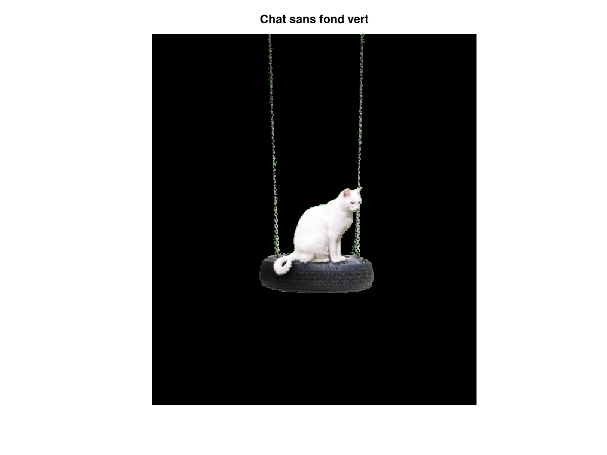
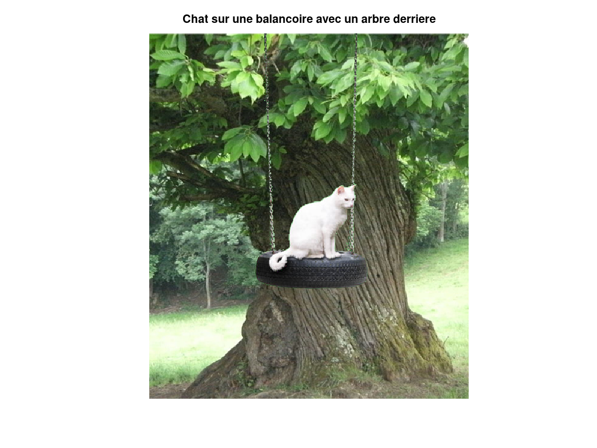
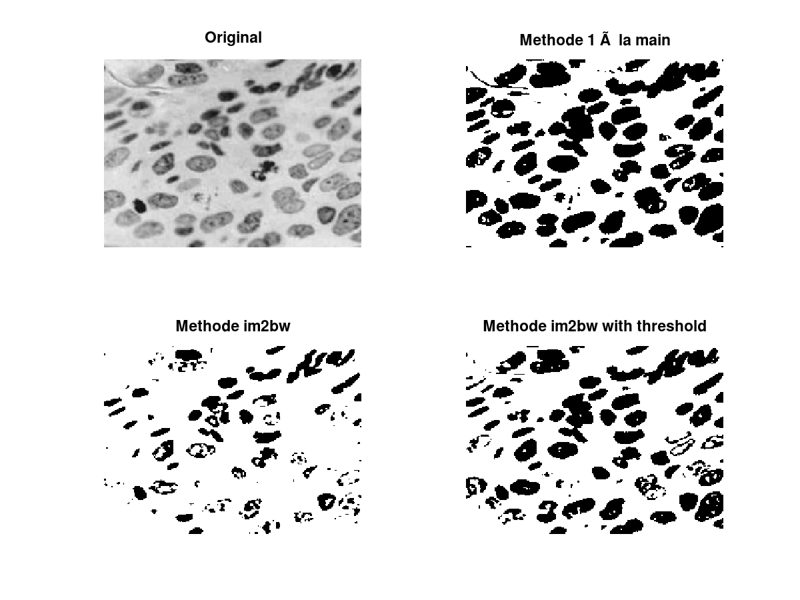

# Traitement d'Image

> Auteurs :
>
> * Léa CHEMOUL
> * Valentin Berger

## TP2 - Histogrammes

### 1 - Arbre à chat

Pour remplacer le fond vert d'une image par une autre image, nous utilisons des masques. Premièrement, il faut créer des filtres de manière à sélectionner une plage de pixels. Dans notre cas, nous savons que les pixels vert sont `rgb(106, 182, 107)`, donc nous faisons varier les pixels de cette façon : `Δr = 106 ± 20`, `Δg = 182 ± 60`, `Δb = 107 ± 30`. Cette variation permet de sélectionner également les pixels proches des contours de la balançoire et du chat. Le code Matlab associé est le suivant :

```matlab
r_filter = (chat(:, :, 1) >= 106 - 20) & (chat(:, :, 1) <= 106 + 20);
g_filter = (chat(:, :, 2) >= 182 - 60) & (chat(:, :, 2) <= 182 + 60);
b_filter = (chat(:, :, 3) >= 107 - 30) & (chat(:, :, 3) <= 107 + 30);
```

Ensuite, nous créons un masque grâce à l'ensemble de ces filtres. Le masque est un tableau de la même taille que l'image du chat, mais uniquement en 2D, avec aucune dimension de "profondeur" contrairement aux images rgb. Les valeurs contenues sont binaires : `1` signifie que le pixel est gardé, tandis que `0` indique que le pixel est vert, et doit être supprimé. Le masque est obtenu en faisant une opération **AND** entre tous les filtres rouge, vert et bleu. L'extrait de code ci-dessous montre la création de ce masque sous Matlab :

```matlab
px_to_remove = r_filter & g_filter & b_filter;
```

Une fois la masque crée, nous pouvons l'appliquer à l'image de notre chat, en remplaçant toute occurrence de vert par `0` (noir) :

```matlab
chat_r(px_to_remove) = 0;
chat_g(px_to_remove) = 0;
chat_b(px_to_remove) = 0;
```

Voici le résultat obtenu :



Nous remarquons que des contours verts sont encore visible. Cependant, nous n'allons pas agrandir la plage des filtres de peur d'effacer les chaînes de la balançoire. De plus, nous estimons que l'image de l'arbre sera suffisamment détaillée et verte pour masquer ces contours.

Enfin, pour ajouter l'arbre en arrière-plan, il suffit de superposer les deux images. Pour cela, nous allons créer un "trou" dans l'image de l'arbre, qui est la forme du chat et de la balançoire. Ensuite, nous additionnons l'image de l'arbre avec un trou et cette du chat. Etant donné que la partie transparente de l'image du chat est 0, elle ne modifiera pas l'image de l'arbre, et inversement, l'image du chat ne sera pas modifiée car il sera placé dans un "trou" qui sera des pixels égale à 0.

L'opération Matlab est :

```matlab
result(:, :, :) = arbre(:, :, :) - min(255, 255 * chat_transp(:, :, :)) + chat_transp(:, :, :);
```

Le résultat est le suivant :



### 2 - Segmentation



Qu'est-ce qu'un bon seuil ? Ici nous pouvons choisir notre seuil qu'à titre subjectif à l'œil (étant donné que nous n'avons pas de moyen objectif de mesurer et vérifier nos valeurs).
Reste à choisir si nous souhaitons :
- être stricte et ne prendre que les noyaux bien définis dont nous sommes certains (ex: seuil = 120)
- être plus laxiste afin de détecter les noyaux moins bien définis (ex: seuil = 180)
Dans le cas de la recherche d'un cancer il est évident qu'on cherche à être précis et à détecter plus de noyaux possibles quitte à se tromper (cancer alors que sain)

### 3 - Dynamique
Le contraste global calculé est de 1 ce qui est cohérent avec le fait qu'on a un minimum de 0 et un maximum de 1.
Le contraste calculé a partie de l'écart type est plus précise

### 4 - Égalisation


