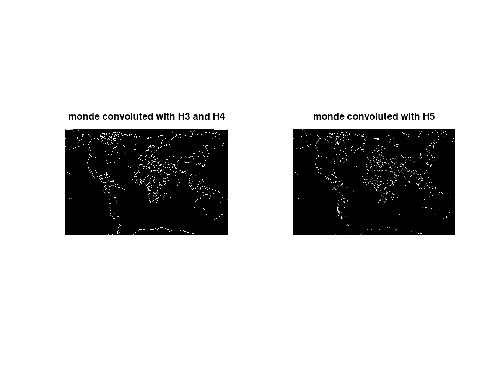
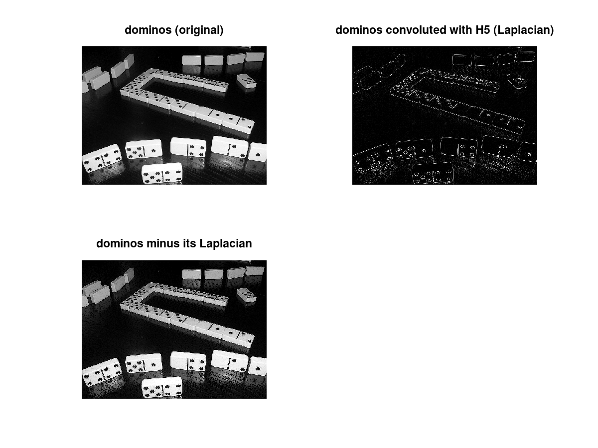
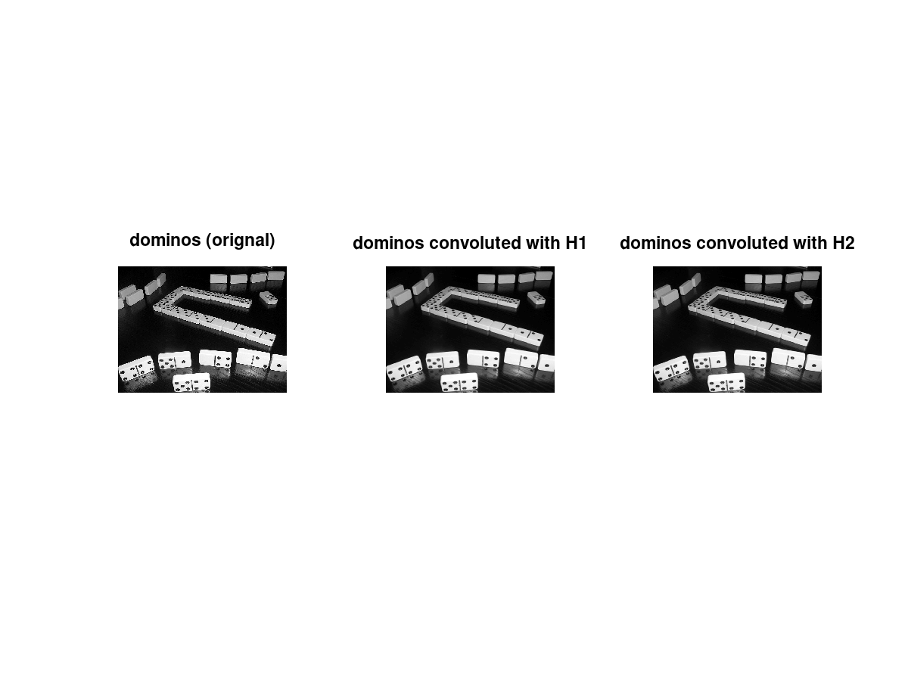
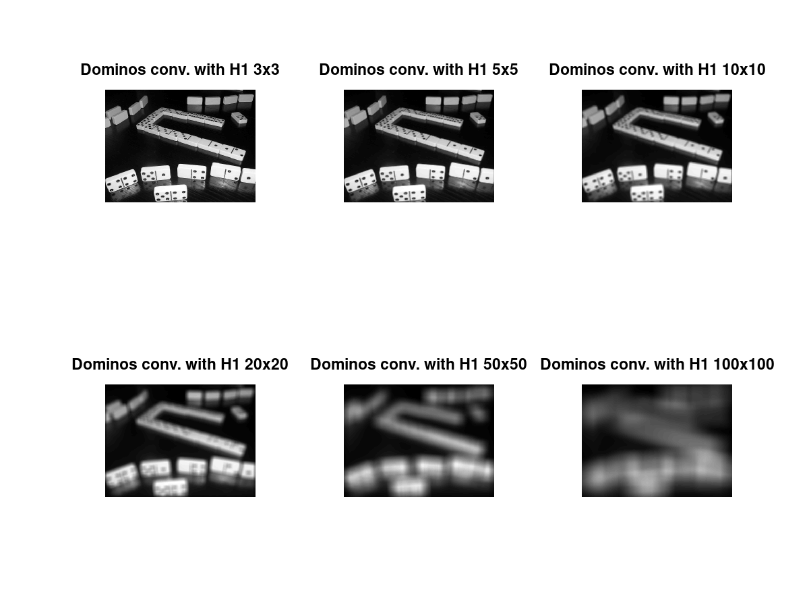

# Traitement d'Image

> Auteurs :
>
> * Léa CHEMOUL
> * Valentin Berger

## TP3 - Filtres linéaires

### 1 - Filtres passe haut

Pour réaliser une convolution 2D sur les images, nous utilisons la fonction Matlab `conv2`.

```matlab
% Convolution 2D de l'image domino avec le masque de convolution H3 :
dominos_conv_h3 = conv2(dominos, H3);
```

> Comment traiter le problème de l’application du masque aux bords de l’image?

Les bords ne sont pas très bien traité avec cette fonction : en effet, `domino` et `lena` ont des bords noirs, ce qui signifie que la convolution a commencé sur les bordure, sans *offset*. Pour résoudre ce problème, nous utilisons le paramètre `shape='same'` :

```matlab
dominos_conv_h3 = conv2(dominos, H3, 'same');
```

En effet, la convolution ne peut s'appliquer sur les bords de l'image, il faut donc réaliser un traitement spécifique pour ces cas. La solution la plus simple consiste à ne pas modifier ces pixels d'où la valeur  `same` qui nous permet de récuperer que la partie centrale de la convolution.

> Appliquer H3 et H4 (ainsi que leur transposée)


Appliquer ces filtres et leur transposée permet de détecter les contours à la fois verticaux et horizontaux. Cependant ils restent encore peu efficace pour détecter les contours diagonaux.
Et ceci est particulierement constatable sur l'image monde.

> Comment pourrait-on modifier H3 pour détecter les contours diagonaux?

Pour détecter les diagonales, nous utilisons le masque suivant :

|    |    |    |
|----|----|----|
| -1 | -1 | 0  |
| -1 | 0  | 1  |
| 0  | 1  | 1  |

> Combiner les détections horizontales et verticales pour H3 et pour H4 et les comparer avec
l’application de H5




> Soutraire le laplacien (H5) à l’image permet d’augmenter son contraste



### 2 - Filtres passe bas

> Appliquer les deux premiers filtres et commenter les résultats.




Nous pouvons observer que les deux images convoluées avec H1 et H2 sont plus **floues** que l'original. En effet, en étudiant de plus près les masques de convolution, nous pouvons voir que H1 applique une **moyenne des 9 pixels** sur lesquels ils s'appliquent, donnant un flou "*carré*". Le filtre H2, cependant, applique une moyenne comme H1, mais avec **des poids** : plus le pixels est proche du centre du masque, plus le poids est grand. Ceci correspond donc à un **flou Gaussien**.

> Quelle(s) différence(s) avec le sur échantillonnage du TP1?

Les masques de convolution suivants agissent comme des filtres passe-bas c'est à dire laissant passer les basses fréquences et atténuant les hautes fréquences qui peuvent être à l'origine de la déterioration des images.

Nous avons vu dans le TP1 qu'un mauvais échantillonnage provoque de l'aliasing (repliement du spectre). C'est une conséquence directe du sous-échantillonnage. On avait vu également que le sur-échantillonnage pouvait être considéré comme de l'anti-aliasing et l'image avait un rendu plus lisse.
C'est le cas aussi pour le filtre passe-bas qui opère également comme de l'anticrénelage en atténuant l'effet d'aliasing même si du bruit reste visible.

On a donc deux méthodes pour limiter le crénelage :
- le sur échantillonnage : plus de definition donc le crénelage est moins visible
- limiter les valeurs à la moitié des fréquences d'échantillonnage par un filtre passe-bas

**L'inconvénient** du filtre passe-bas est qu'il floute l'image, fait perdre un peu de détail, pour la rendre plus nette et donc pour limiter le crénelage.

**L'avantage** du filtre passe bas c'est que cette méthode est beaucoup **moins gourmande en performance**, couteuse que le sur-échantillonnage puisque pour cette dernière méthode il s'agit de calculer une image dont la résolution est 2 à 4 fois plus grande que celle souhaitée puis de la redimensionner par certains filtres. Par exemple, pour un sur-échantillonnage x2, l'image sera 4 fois plus grande, ce qui est d'autant plus de calcul et d'espace mémoire.


> Quelle est l’influence de la taille du filtre pour H1?

H1 fonctionne comme un filtre passe-bas effectuant un lissage global de l'image. Plus sa taille est grande plus le floutage des contours et la suppression des détails est important comme nous pouvons le constater sur la série d'images ci-dessous.



Nous avons également étudié l'influence de la taille pour H2. Comme H2 est un filtre Gaussien, nous nous appuyons sur la formule suivante pour créer une matrice de taille  :

&space;=&space;\frac{1}{2&space;\pi&space;\sigma^2}&space;e^{-\frac{x^2&space;&plus;&space;y^2}{2&space;\sigma^2}})

Sous Octave, nous utilisons la fonction suivante pour créer un tel masque :

```matlab
fspecial("gaussian", [n, m], sigma)
```

Voici les résultats obtenus sur **dominos** avec les même tailles prises pour l'expérience ci-dessus et `sigma=20` :


Nous remarquons que le flou est différent de celui généré par H1, grâce à la moyenne pondérée utilisée.
