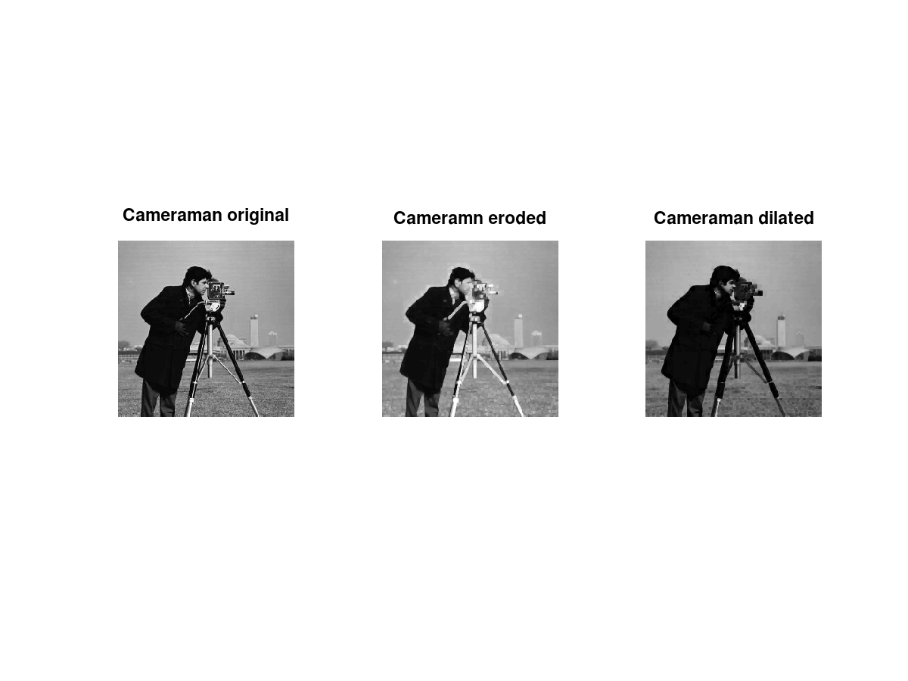

# Traitement d'Image

> Auteurs :
>
> * Léa CHEMOUL
> * Valentin Berger

## TP3 - Filtres non linéaires

### 1 - Fermeture

### 2 - Contours

Le filtre passe haut du TP3 nous permettait de detecter les contours d'une image aux moyens de masques.
La méthode du gradient permet de detecter les contours à la fois verticaux, horizontaux et diagonaux. Il fonctionne comme la combinaison des masques du TP3.

### 3 - Débruitage
