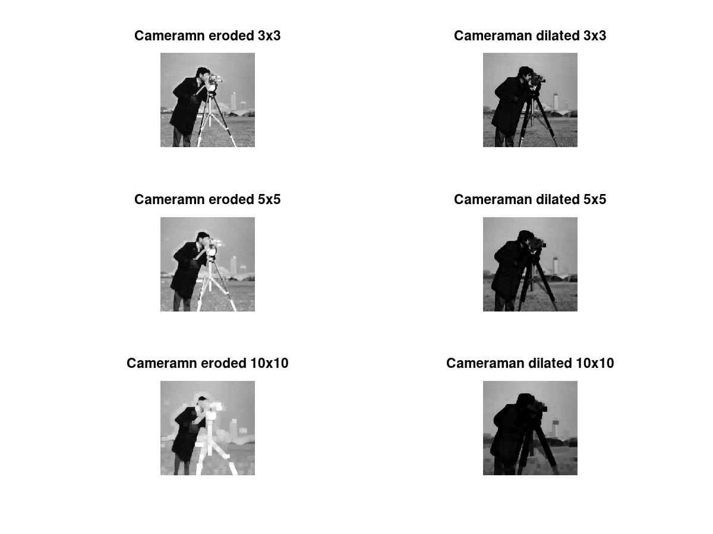
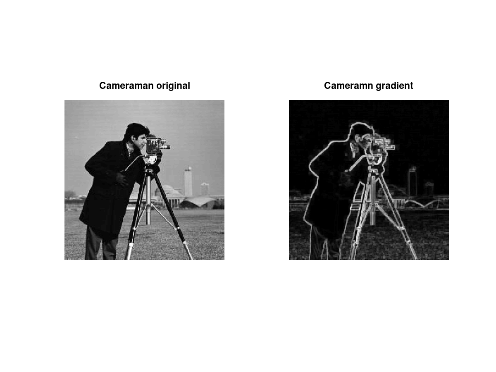
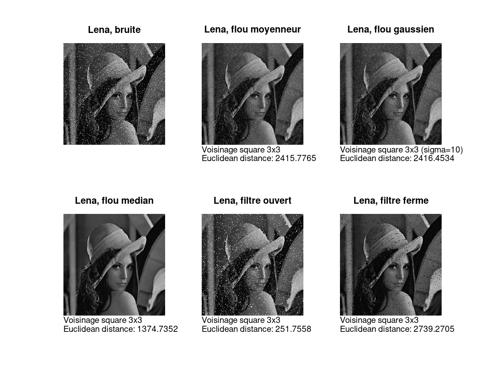
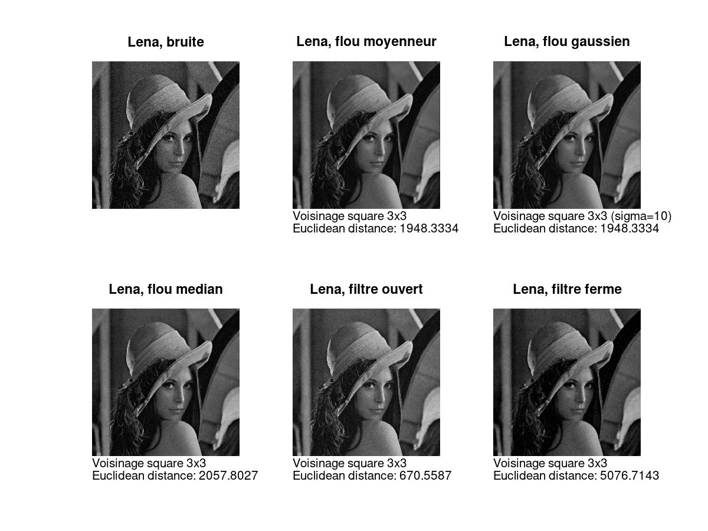

# Traitement d'Image

> Auteurs :
>
> * Léa CHEMOUL
> * Valentin Berger

## TP3 - Filtres non linéaires

### 1 - Fermeture

Nous souhaitons appliquer différents filtres non linéaires à l'image "*cameraman*". Les premiers filtres à appliquer sont "eroder" et "dilater", que l'on peut appliqué avec les fonctions "`imerode`" et "`imdilate`" respectivement. La forme géométrique du voisinage est donné par la fonction "`strel`". Afin de simplifier l'appel à ces fonctions, nous créons une fonction Octave qui prend en paramètre une image, une taille de voisinage, une forme de voisinage (par défault `"square"`) et une forme de résultat (par défault `"same"`). Elle retourne deux images : l'image éroder et l'image dilaté. Cette fonction permet également d'inverser automatiquement le noir et le blanc de l'image donné, et de le ré-inverser sur le résultat, car les filtres non-linéaire assument que le noir est une forte valeur, et le blanc une faible valeur (ce qui est l'inverse du paradigme utilisé pour les images). Le code de la fonction est :

```matlab
function [im_erode, im_dilate] = erode_dilate(im, strel_size, strel_shape = "square", shape = "same")
	se = 0;
	if (strcmp(strel_shape, 'disk') == 1)
		se = strel(strel_shape, strel_size, 0);
	else
		se = strel(strel_shape, strel_size);
	endif
	im_erode = 255-imerode(255-im, se, shape);
	im_dilate = 255-imdilate(255-im, se, shape);
endfunction
```

On remarque que cette fonction contient une condition. En effet, la fonction `strel` prend un troisième argument dans le cas où la forme du voisinage est `"disk"`.

Nous appliquons la fonction `erode_dilate` à l'image "*cameraman*", avec une forme de voisinage de `"square"` et une taille de 3 :


Afin de voir l'impacte de la taille de voisinage (donné dans la fonction `strel`), nous répétons l'application de la fonction sur "*cameraman*" avec différentes tailles, et toujours la forme `"square"` :



Nous pouvons en effet remarquer que plus la taille de voisinage est grande, plus l'image semble floue.

Maintenant, nous souhaitons voir l'impacte de la forme de voisinage. Nous fixons la taille de voisinage à 5, et nous affichons "*cameraman*" avec les formes `"square"`, `"diamond"` et `"disk"` :


Nous pouvons facilement observer une différence entre `"square"` et `"diamond"`, et entre `"square"` et `"disk"` ; cependant, la différence entre `"diamond"` et `"disk"` est plus subtile, à cause de leur forme géométrique proche. Nous pouvons cependant voir une différence au niveau du point lumineux en haut de la tour dans le fond de l'image : elle est en forme de losange dans `"diamond"` et ronde dans `"disk"`.

Enfin, nous désirons appliquer des filtres d'ouverture et de fermeture sur l'image. On rappele que :

* fermeture = `imerode(imdilate(img))`
* ouverture = `imdilate(imerode(img))`

Nous créons ainsi la fonction Octave suivante :

```matlab
function [im_closed, im_opened] = close_open(im, strel_size, strel_shape = "square", shape = "same")
	se = 0;
	if (strcmp(strel_shape, 'disk') == 1)
		se = strel(strel_shape, strel_size, 0);
	else
		se = strel(strel_shape, strel_size);
	endif
	im_closed = 255 - imerode(imdilate(255-im, se, shape), se, shape);
	im_opened = 255 - imdilate(imerode(255-im, se, shape), se, shape);
endfunction
```

Le résultat sur "*cameraman*" avec une forme de voisinage `"square"` et une taille de 3 :


On peut voir que l'image fermée est plus *sombre* alors que l'image ouverte est plus *claire*.

### 2 - Contours



Le filtre passe haut du TP3 nous permettait de detecter les contours d'une image aux moyens de masques.
La méthode du gradient permet de detecter les contours à la fois verticaux, horizontaux et diagonaux. Il fonctionne comme la combinaison des masques du TP3.

### 3 - Débruitage







