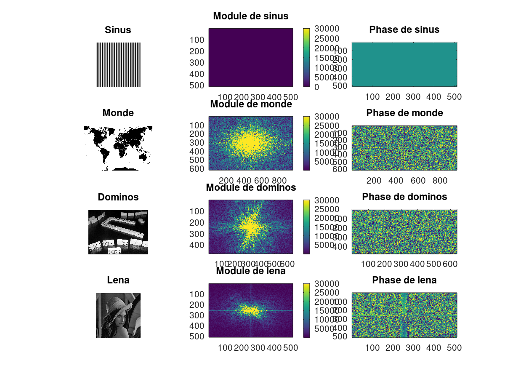

# Traitement d'Image

> Auteurs :
>
> * Léa CHEMOUL
> * Valentin Berger

## TP4 - Filtres non linéaires

### 1 - Prise en main

L'image ci-dessous montre pour chaque image son module et sa phase après transformation de Fourier :

On peut voir que le module nous donne en effet beaucoup d'information sur les bords des images. Par exemple, dans l'image "*dominos*", nous observons une diagonal partant d'en haut à droite et allant en bas à gauche (la suite de dominos en arrière plan). On retrouve cette diagonal dans le module, avec une ligne inversée en jaune.

Inversement, on observe que le module de "*monde*" n'a pas de ligne distinctes. En effet, comme les contours des continents ne sont pas constants, il est normal d'avoir un module formant un nuage de points plutôt que de voir apparaître des lignes.

Pour terminer, l'image "*lena*" est une fusion des deux image précédant : la diagonale crée par le contour du chapeau est distinguable sur le module, mais on peut également y voir un nuage de points au centre, formé par la compléxité des contours de l'image originale.

### 2 - Module et phase

La phase permet de mettre en évidence le décalage entre les fréquences, cela permet de determiner à peu près ou se situe notre image.
Le module quand à lui indique l'intensité.
Nous combinons le module de Manhattan ainsi que la phase de Beach puis nous appliquons la transfomrée de Fourier inverse afin de retrouver l'image associée. Voici ce que nous obtenons :

Nous pouvons bien :
- distinguer la plage (puisque nous avons récupéré la phase de Beach donc la position des fréquences)
- apercevoir les différences de fréquences propres à Manhattan

### 3 - Filtrage
